# AIF SCP Workflow Integration Sample
 AIF SCP Workflow integration sample projects as reference content. Users can download and import the content of this project to their tenant to understand and learn how-to integrate AIF and SAP Cloud Platform workflow.  

[SAP Cloud Platform (SCP) Workflow](https://cloudplatform.sap.com/capabilities/product-info.SAP-Cloud-Platform-Workflow.df696e5a-d973-4ecd-8d8d-532d60aa1921.html) allows you to build, run, and manage workflows, from simple approvals to end-to-end processes that can span across different organizations and applications. With an inbox application and custom-built user interfaces, you involve end-users into business processes for decision making and data entry.

[SAP Application Interface Framework (AIF)](https://www.sap.com/products/application-interface-mgmt.html) allows you implement, monitor, and manage application interfaces from a central location to simplify interface handling across your system landscape.

This AIF SCP Workflow Integration sample project contains a workflow applications to demonstrate the usage of SAP Cloud Platform Workflow in the context of integrating AIF with the SCP workflow together. **It's only intended to be used as a reference content for the development of AIF workflow integration applications, not for production usage directly.**

# Scenario
While message processing in S/4 HANA error occurs in the AIF, the AIF creates an alert to inform the business user.   
While this alert, also a workflow instance in SCP Workflow service can be created and assigned to specific user of a group.   
Within the processing in SCP Workflow service, the users are able to see the error logs of the AIF message.  

# Requirements
SAP Cloud Platform Tenant - If you do not have one, then you could get your hands on to a [free trial account](http://cloudplatform.sap.com/try.html).  
Active subscription to [SAP Cloud Platform Workflow](https://www.sap.com/developer/tutorials/cp-workflow-getting-started.html) in your SAP Cloud Platform tenant.  
[Enable Workflow feature](https://help.sap.com/viewer/f85276c5069a429fa37d1cd352785c25/Cloud/en-US/07adfa6d819a42e9966e63de1a654de4.html) in SAP WebIDE Full-Stack.  
Active subscription to Portal service and SAP WebIDE Full-Stack in your SAP Cloud Platform tenant.  
S/4 HANA system with AIF interface.

# Setup Guide
## Setup in SAP Cloud Platform
### Create Workflow Service Instance
[Refer to help document](https://help.sap.com/viewer/65de2977205c403bbc107264b8eccf4b/Cloud/en-US/5516f912bae84922ba8c8eb46b8bfce5.html), create a new workflow service instance with following parameters:

	Instance Name: AIF_Alert_Management
	Parameters   : 
	{
	    "authorities": [
		"WORKFLOW_INSTANCE_START",
		"WORKFLOW_DEFINITION_GET",
		"WORKFLOW_INSTANCE_GET",
		"WORKFLOW_INSTANCES_UPDATE",
		"WORKFLOW_INSTANCE_CANCEL",
		"WORKFLOW_INSTANCE_GET_ERROR_MESSAGES",
		"WORKFLOW_INSTANCE_GET_CONTEXT",
		"WORKFLOW_INSTANCE_GET_EXECUTION_LOGS",
		"MESSAGE_SEND"
	    ]
	}

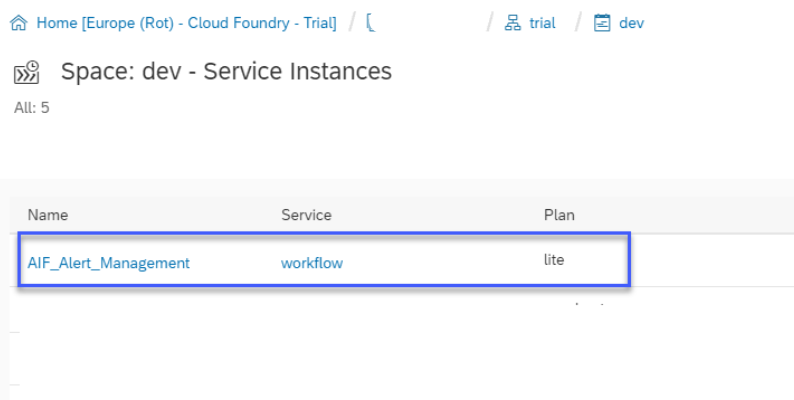
  

### Create Role Collection
[Refer to help document](https://help.sap.com/viewer/65de2977205c403bbc107264b8eccf4b/Cloud/en-US/d5f1612d8230448bb6c02a7d9c8ac0d1.html), create a new role collection with following parameters:  

	Role Collection Name: AIF_WF_role_collection
	Description         : AIF Message Monitor

After role created, click the role name in the role collection list, in next page, click “Add Role” button, add roles list below:

	WorkflowAdmin
	WorkflowContextAdmin
	WorkflowContextViewer
	WorkflowDeveloper
	WorkflowInitiator
	WorkflowMessageSender
	WorkflowParticipant
	WorkflowTenantOperator
	WorkflowViewer
	
 

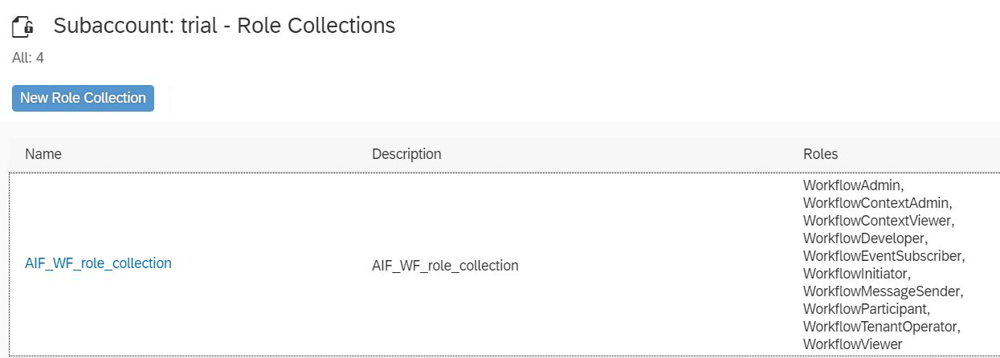
  

### Assign Role Collection
After creating the role collection, [refer to help document](https://help.sap.com/viewer/65de2977205c403bbc107264b8eccf4b/Cloud/en-US/9e1bf57130ef466e8017eab298b40e5e.html), assign the users who will monitor the workflow instances to the created role collection.

### Create Destination for Email Service
[Refer to help document](https://help.sap.com/viewer/e157c391253b4ecd93647bf232d18a83/Cloud/en-US/45220d841c704a4c8ac78618207ee103.html), create a new mail destination with following parameters:  

	Destination Name: bpmworkflowruntime_mail
	Parameters      :   
		mail.user=<your email user> 
		mail.password=<your email password>
		mail.smtp.host=<you email provider’s host>
		mail.smtp.port=<your mail server port>
		mail.transport.protocol=smtp
		mail.smtp.starttls.required=true
		mail.smtp.starttls.enable=true
		mail.smtp.auth=true
		mail.smtp.from=<your email address>
		mail.smtp.ssl.checkserveridentity=true
		mail.bpm.send.disabled=false

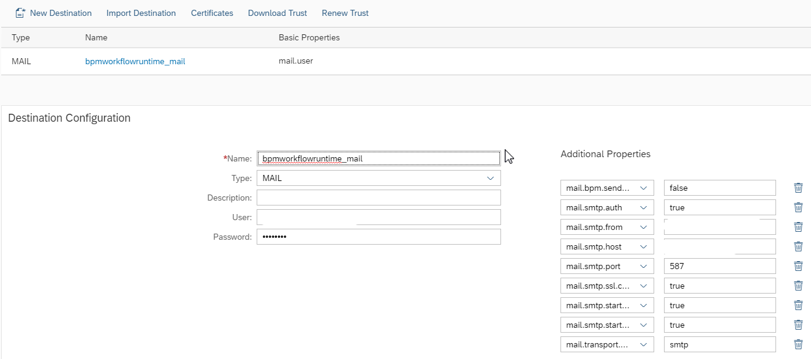
    

### Download and Deploy Workflow Monitoring LaunchPad
Download or clone the following content from Git repository:  

	aif-scp-workflow-integration-sample --> WorkflowLaunchpad.zip

[Refer to help document](https://help.sap.com/viewer/825270ffffe74d9f988a0f0066ad59f0/CF/en-US/51321a804b1a4935b0ab7255447f5f84.html), login to SAP WebIDE Full-Stack and import the "WorkflowLaunchpad.zip" into the workspace.
Once the import is successful, [build and deploy](https://help.sap.com/viewer/825270ffffe74d9f988a0f0066ad59f0/CF/en-US/1b0a7a0938944c7fac978d4b8e23a63f.html) the project to SAP Cloud Platform.

After successful deployment, open your SCP cockpit, navigate to the space you deployed the project.  
Select the menu item “Application”, in the right list of application, you should be able to see an application with name “WorkflowLaunchpad_appRouter”.  
Looks like below:
 
 
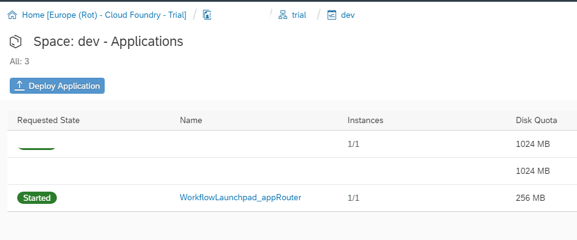
    

#### Find the Monitoring Launchpad URL
Click the application "WorkflowLaunchpad_appRouter", the application details will be displayed in another browser tab/window.  
In the “Application Routes” section, you can get the URL of the Workflow Monitor Launchpad.   
Note this URL.  

 
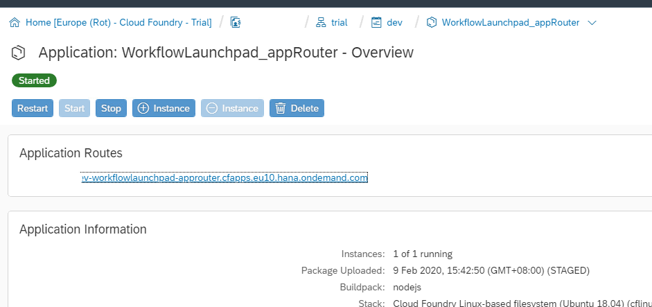
    

### Download and Deploy Workflow AIFAlertManagement
Download or clone the following content from Git repository:  

	aif-scp-workflow-integration-sample --> AIFAlertManagement.zip

[Refer to help document](https://help.sap.com/viewer/825270ffffe74d9f988a0f0066ad59f0/CF/en-US/51321a804b1a4935b0ab7255447f5f84.html), login to SAP WebIDE Full-Stack and import the "AIFAlertManagement.zip" into the workspace.  
Once the import is successful, expand the “AIFAlertWorkflow” folder, expand the “workflows” subfolder, double click the file “AIFAlert.workflow”.   
The workflow definition should be open in the right editor.  
Select the “Send Error Mail” mail task, in the right properties section, switch to “Details” tab, change the “To” field with the email addresses which should receive the alert email for workflow instance, save your change.  

 
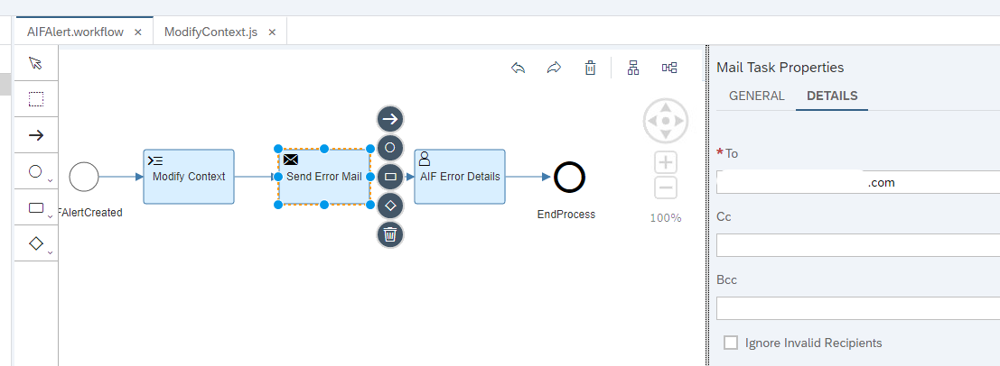
    

[Build and deploy](https://help.sap.com/viewer/825270ffffe74d9f988a0f0066ad59f0/CF/en-US/1b0a7a0938944c7fac978d4b8e23a63f.html) to the project to SAP Cloud Platform.

#### Find the Service Key Data
After successful deployment, open your SCP cockpit, navigate to the space you deployed the project.  
Select the menu item “Services”-> “Service Instances”, in the right list of application, click the application name “AIF_Alert_Management”, the details of this application will be displayed in a new page.  
From the bottom section, a json file is displayed, find the following information from this json.  

	clientid
	clientsecret
	url
	
Below is a sample service key:

 
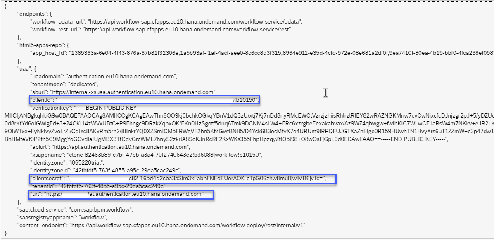
    

## Setup in SAP S/4 HANA System
Logon to your SAP S/4 HANA System.
### Setup the RFC Destinations
Open transaction "SM59", create a new RFC destination with connection type “G”.  
In the “Technical Settings” section, maintain the following parameters:  

	Targ       : api.workflow-sap.cfapps.eu10.hana.ondemand.com (might be different based on your SCP account)
	Path Prefix: /workflow-service
	
Below is a sample destination.    

 
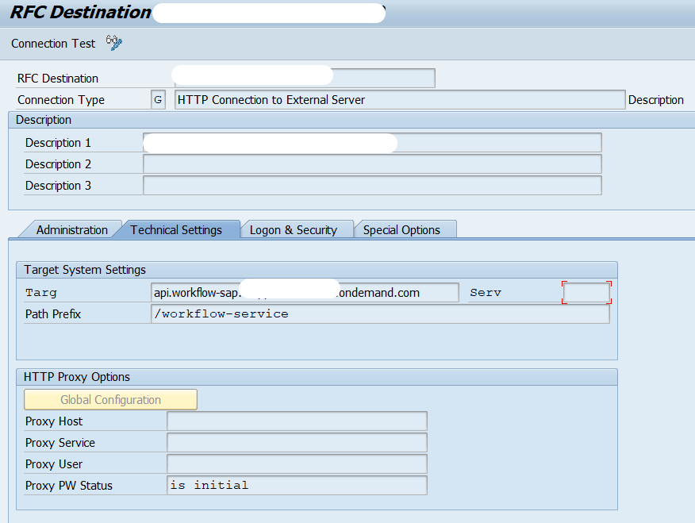
    

Open transaction “SBGRFCCONF”, create a new bgRFC inbound destination “BC_CPWF_INBOUND_DEST” as below:    

 
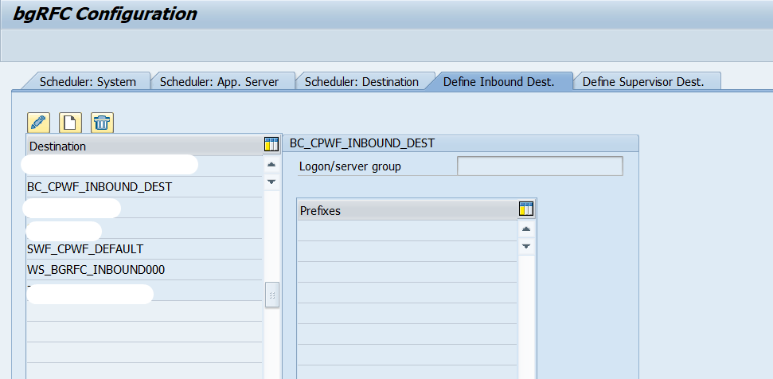
 

### Setup the oAuth2 Client Profile Configuration
Open transaction “OA2C_CONFIG”, the Web Dynpro application should be open in your default browser.   
Create (if already existing, then change) configuration “SWF_CPWF_OAUTH_PROFILE” for oAuth2 client profile “SWF_CPWF_OAUTH_PROFILE”.    
Fill the following parameters for the profile configuration:   

	OAuth 2.0 Client ID           : the client id you got previously
	Client Secret                 : the client secret you got previously
	Authorization Endpoint        : the url you got previously + /oauth/authorize
	Token Endpoint                : the url you got previously + /oauth/token
	Client Authentication         : Basic
	Resource Access Authentication: Header Field
	Selected Grant Type           : Client Credentials 
	
Looks like below:  

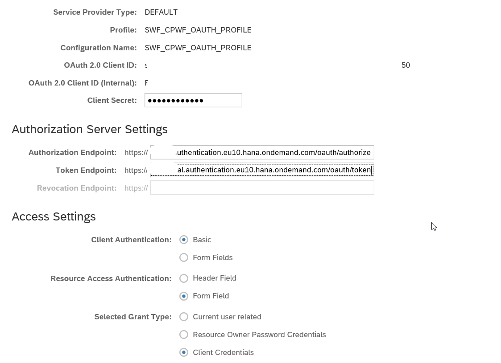
 

### Link AIF with SCP Workflow Service
Open transaction “SM30”, in the input field “Table/View”, fill value “V_SWF_CPWF_DEST”, click the “Maintain” button.  
In the data maintenance overview screen, if there is no entry for Consumer Type “AIF_ALERT”, create a new entry. Fill the following fields:    

	Destination  : the RFC destination (type “G”) you created previously
	Configuration: the profile configuration you created previously

Looks like below:  

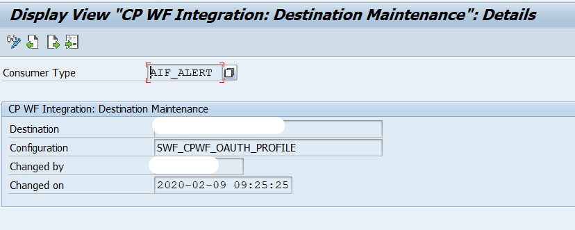
 

### Link AIF Interface with Workflow Definition
Open transaction “/AIF/CUST”, click IMG node “SAP Application Interface Framework” -> “System Configuration-> “SCP Workflow Service Integration” -> “Settings for Integration of SCP Workflow Service”.  
In the data maintenance overview screen, create a new entry for your AIF interface.     
Fill the following fields:    

	Ext Workflow ID: aifalert
	
Looks like below:   

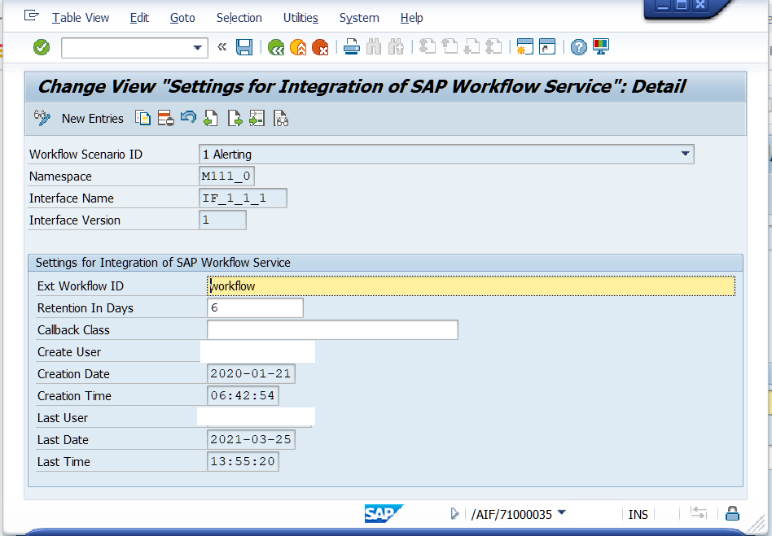
 

# Trigger AIF Message and Workflow Instance
## Send Test Data
Logon to your SAP S/4 HANA System.
Send AIF message with error logs for the AIF interface you configured previously.

# Monitoring at SCP	
Open your web browser, logon to the Monitoring Launchpad URL you got previously.    
In the Fiori Launchpad, select tile “My Inbox”, the user task application will be displayed.    
Select the list item, in the right part of the same page, the AIF message information will be displayed.  
Looks like below:  

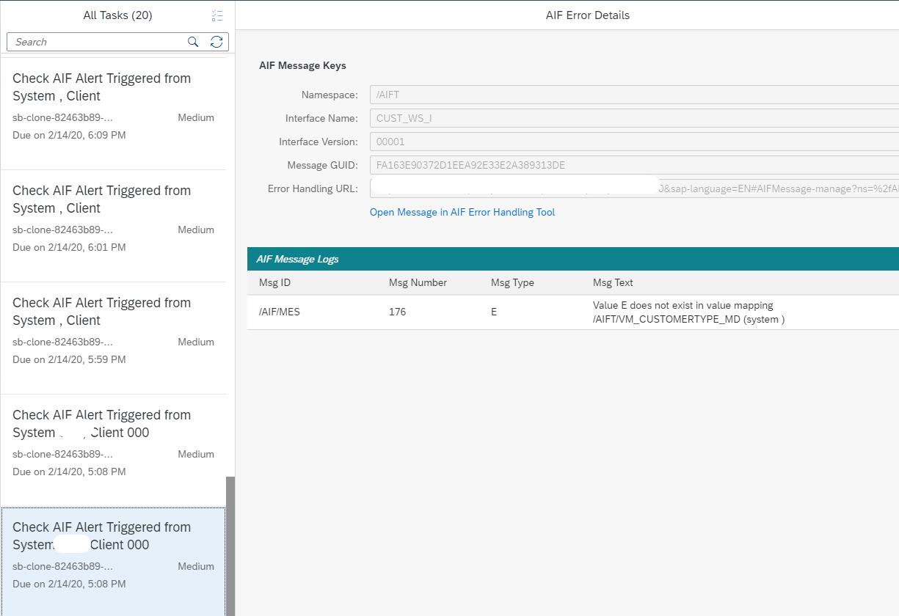
 

# Trouble Shooting
## SCP Service Call Logs
If you have triggered the AIF message from S/4 HANA system, but cannot see any user task in the SCP Monitoring Launchpad inbox.
You can logon to your S/4 HANA system, open transaction “SLG1”.  
In the selection screen, fill the following parameters:  

	Object          : /AIF/LOG	
	Subobject       : /AIF/NOTIF
	From (Date/Time): The date you sent message 00:00:00
	To (Date/Time)  : The date you sent message 23:59:59

Press “Execute” button.   
You can check the SCP service call logs in the result list, looks like below:  

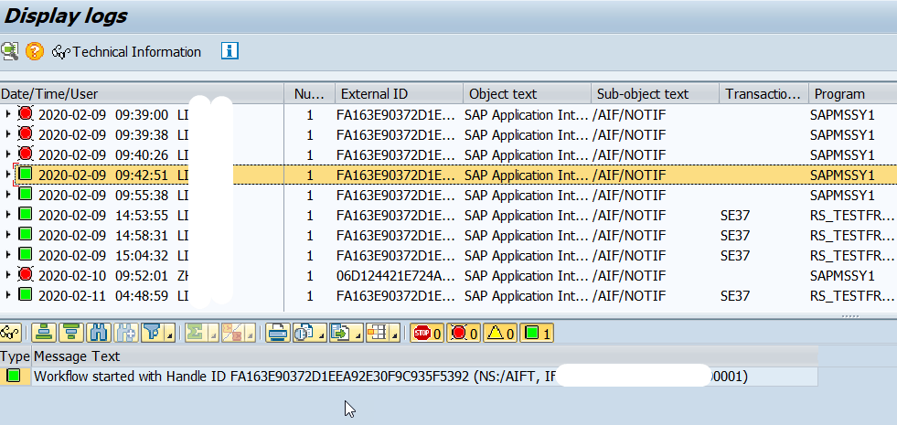
 

# Known Issues
In this sample project, only displaying the AIF message information is possible.  
Change AIF message content, restart/cancel AIF message is not possible.

# How to Obtain Support
The project is provided "as-is", with no expected changes or support.

# License
Copyright (c) 2020 SAP SE or an SAP affiliate company. All rights reserved. This file is licensed under the Apache Software License, version 2.0 except as noted otherwise in the [LICENSE](https://github.com/SAP-samples/fsm-extension-sample/blob/master/LICENSE) file

